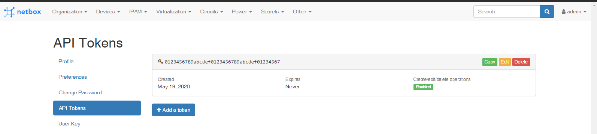

## Hướng dẫn call API

Tôi sử dụng postman để thực hiện call API tới ứng dụng netbox.

Hướng dẫn call API tham khảo tại [link](https://netbox.readthedocs.io/en/stable/api/examples/)

Bước 1: Khi mở giao diện postman, ta tạo mới một GET request

Bước 2: Tại phần nội dung hiển thị bên phải, ta điền thông tin URI tương ứng cần lấy thông tin vào. ở đây tôi sử dụng API để lấy thông tin về device có ID là 2

Danh mục các URI API thì lấy tại mục API trong ứng dụng netbox

Bước 3: Thông tin token thì lấy từ phần Profile của tài khoản đăng nhập.

Bước 4: Tạo mục headers, ta thêm một key `Authorization` với giá trị là `Token ID_TOKEN` trong đó ID_TOKEN lấy từ trong profile.

Bước 5: Nhấn vào nút Send sẽ ra kết quả mong muốn.

